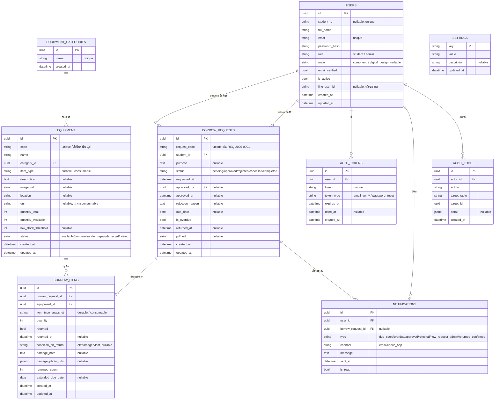

# 2. ออกแบบระบบ (System Design)

> เอกสารนี้ต่อเนื่องจาก `01-proposal.md` ใช้สำหรับขั้นตอน "ออกแบบระบบ" ตาม checklist ของอาจารย์ (block diagram / สถาปัตยกรรม / เทคโนโลยี / อุปกรณ์ที่เลือก) และเป็นฐานอ้างอิงให้ `CLAUDE.md` ใช้ตอนเริ่มเขียนโค้ดจริง

## 2.1 ภาพรวมเทคโนโลยี (Technology Stack)

| ส่วน | เทคโนโลยี | เหตุผล |
|---|---|---|
| Backend | Python + FastAPI | มี Swagger UI อัตโนมัติ, ใช้ Type hint + Pydantic validate ข้อมูล อ่าน/อธิบายโค้ดง่าย |
| ORM / Migration | SQLAlchemy 2.0 + Alembic | มาตรฐานคู่กับ FastAPI, ติดตาม schema history ได้ |
| Database | PostgreSQL | รองรับ JSONB, constraint, เหมาะกับ relational data แบบนี้ |
| Frontend | React + Vite + TailwindCSS | เขียนเร็ว, ดูแลง่ายคนเดียว |
| Deployment | Docker Compose บนเซิร์ฟเวอร์คณะ | ย้ายเครื่อง/ตั้งใหม่ง่าย ไม่ผูกกับเครื่องใดเครื่องหนึ่ง |
| Auth | JWT (access + refresh token) | Stateless เหมาะกับ FastAPI, ไม่ต้องเก็บ session ฝั่งเซิร์ฟเวอร์ |

## 2.2 แผนภาพ ER (Entity Relationship Diagram)



## 2.3 รายละเอียดแต่ละตาราง

### users
เก็บทั้งนักศึกษาและแอดมิน/อาจารย์ในตารางเดียว แยกด้วยคอลัมน์ `role`
- `student_id` เป็น NULL ได้สำหรับบัญชีแอดมิน (แอดมินไม่มีรหัสนักศึกษา)
- `major` จำกัดแค่ 2 ค่า (`comp_eng`, `digital_design`) ตามขอบเขตที่ตกลงกัน เป็น NULL สำหรับแอดมิน
- `email_verified` ต้องเป็น `true` ก่อนนักศึกษาจะเข้าใช้งานได้ (ยืนยันผ่านลิงก์ในอีเมล)
- Index: unique บน `email`, unique บน `student_id`, index บน `role`

### equipment_categories
ตารางหมวดหมู่อย่างง่าย (เช่น "เครื่องมือไฟฟ้า", "วัสดุงานบัดกรี") ใช้ร่วมกันได้ทั้งครุภัณฑ์และของสิ้นเปลือง

### equipment
ตารางเดียวรองรับทั้งครุภัณฑ์และของสิ้นเปลือง แยกด้วย `item_type`
- ครุภัณฑ์: `quantity_total = 1` เสมอ (นับเป็นชิ้นไม่ซ้ำกัน มี `code` เฉพาะตัวสำหรับ QR)
- ของสิ้นเปลือง: `quantity_total` คือจำนวนสต็อกจริง, `unit` ระบุหน่วย (ชิ้น/เมตร/กรัม)
- `quantity_available` ลดลงเมื่อมีการยืม/เบิก ต้องมี CHECK constraint `quantity_available <= quantity_total` และ `quantity_available >= 0`
- `status` มีความหมายชัดสำหรับครุภัณฑ์ (available/borrowed/under_repair/damaged/retired) ส่วนของสิ้นเปลืองดูสถานะ "มี/ไม่มีของ" จาก `quantity_available` แทน
- Index: unique บน `code`, index บน `category_id`, `item_type`, `status`

### borrow_requests
ตารางหัวคำขอยืม 1 คำขอ = 1 ครั้งที่นักศึกษากดยืม อาจมีอุปกรณ์หลายชิ้นอยู่ใน `borrow_items`
- `due_date` คำนวณจาก `approved_at` + ค่า `max_loan_days_durable` ใน settings (เฉพาะคำขอที่มีของประเภท durable)
- `is_overdue` อัปเดตโดย background job เทียบ `due_date` กับเวลาปัจจุบัน ไม่ต้องคำนวณสดทุกครั้งที่ query
- `approved_by` เป็น NULL จนกว่าจะมีแอดมินอนุมัติ/ไม่อนุมัติ
- Index: index บน `student_id`, `status`, `due_date` (ใช้กับ job แจ้งเตือน), unique บน `request_code`

### borrow_items
รายการอุปกรณ์แต่ละชิ้นในคำขอยืม เก็บสถานะการคืนแยกรายชิ้น เพื่อรองรับการคืนไม่พร้อมกัน
- `item_type_snapshot` กันปัญหาถ้าวันหลังมีคนเปลี่ยน `item_type` ของอุปกรณ์ใน catalog ย้อนหลัง ข้อมูลประวัติจะไม่เพี้ยน
- ของสิ้นเปลือง: ตั้ง `returned = true` ตั้งแต่ตอนอนุมัติทันที (เบิกแล้วไม่ต้องคืน)
- `damage_photo_urls` เก็บเป็น array ของ path รูปถ่ายหลักฐานความเสียหายตอนคืน
- `renewed_count` ใช้คุมไม่ให้ต่อเวลาเกิน `max_renew_count` ที่กำหนดใน settings

### settings
ตาราง key-value สำหรับค่าที่ปรับได้โดยไม่ต้องแก้โค้ด ดูค่าเริ่มต้นในหัวข้อ 2.5

### auth_tokens
ใช้ร่วมกันสำหรับ 2 วัตถุประสงค์ (`token_type` แยก): ยืนยันอีเมลตอนลงทะเบียน และลิงก์ตั้งรหัสผ่านใหม่ มี `expires_at` ป้องกันลิงก์เก่าใช้ซ้ำ

### notifications
Log การแจ้งเตือนที่ส่งไปแล้วทุกช่องทาง ป้องกันการแจ้งซ้ำซ้อน (เช็คก่อนส่งว่ามี record ของวันนี้+ประเภทนี้แล้วหรือยัง) และใช้แสดงกระดิ่งแจ้งเตือนในระบบ (`channel = in_app`)

### audit_logs
บันทึกการกระทำสำคัญของแอดมินทุกครั้ง (`approve_request`, `reject_request`, `confirm_return`, `create_equipment`, `update_equipment`) เพื่อตรวจสอบย้อนหลังได้ว่าใครทำอะไรเมื่อไหร่

## 2.4 Enum ที่ใช้ในระบบ

| คอลัมน์ | ค่าที่เป็นไปได้ |
|---|---|
| `users.role` | `student`, `admin` |
| `users.major` | `comp_eng`, `digital_design` |
| `equipment.item_type` | `durable`, `consumable` |
| `equipment.status` | `available`, `borrowed`, `under_repair`, `damaged`, `retired` |
| `borrow_requests.status` | `pending`, `approved`, `rejected`, `cancelled`, `completed` |
| `borrow_items.condition_on_return` | `ok`, `damaged`, `lost` |
| `auth_tokens.token_type` | `email_verify`, `password_reset` |
| `notifications.type` | `due_soon`, `overdue`, `approved`, `rejected`, `new_request_admin`, `returned_confirmed` |
| `notifications.channel` | `email`, `line`, `in_app` |

## 2.5 ค่าเริ่มต้นในตาราง settings (Seed Data)

| key | value | คำอธิบาย |
|---|---|---|
| `max_loan_days_durable` | `7` | ยืมครุภัณฑ์ได้สูงสุดกี่วัน |
| `max_renew_days` | `7` | ต่อเวลาได้เพิ่มกี่วัน |
| `max_renew_count` | `1` | ต่อเวลาได้กี่ครั้งต่อรายการ |
| `max_items_per_request` | `5` | จำนวนรายการสูงสุดต่อคำขอ 1 ครั้ง |
| `max_active_requests_per_student` | `2` | จำนวนคำขอที่ยืมพร้อมกันได้สูงสุดต่อคน |
| `due_soon_notify_days_before` | `1` | แจ้งเตือนล่วงหน้ากี่วันก่อนครบกำหนด |

ค่าทั้งหมดนี้แก้ผ่านหน้า Settings ของแอดมินได้ ไม่ต้องแก้โค้ด/deploy ใหม่

## 2.6 สถานะและการเปลี่ยนสถานะ (State Transitions)

**borrow_requests.status**
```
pending → approved → completed
pending → rejected
pending → cancelled   (นักศึกษายกเลิกก่อนแอดมินอนุมัติ)
```
`is_overdue` เป็น flag แยก ไม่ใช่ state — ตั้งเป็น `true` โดย background job เมื่อ `status = approved` และเลย `due_date` แล้วแต่ยังไม่ `completed`

**equipment.status** (มีผลกับครุภัณฑ์เป็นหลัก)
```
available → borrowed       (เมื่อ borrow_item ถูกอนุมัติ)
borrowed  → available       (คืนแล้ว สภาพปกติ)
borrowed  → damaged         (คืนแล้ว แอดมินตรวจพบความเสียหาย)
(ทุกสถานะ) → under_repair / retired   (แอดมินปรับเองตามจริง)
```

## 2.7 รายการที่รอข้อมูลเพิ่มเติม (Pending Items)

- **ไฟล์ Excel คลังอุปกรณ์เดิม** — รออีกทีมส่งมา เมื่อได้รับแล้วจะทำ column mapping จากไฟล์เดิม → ตาราง `equipment` / `equipment_categories` และเขียนสคริปต์ import (ไม่ต้องรื้อ schema ปัจจุบัน ออกแบบเผื่อความ flexible ไว้แล้วในคอลัมน์ `description` และโครงสร้างหมวดหมู่ที่เปิดกว้าง)

## 2.8 การออกแบบ API (REST Endpoint Design)

แบ่ง endpoint ตาม router (ตรงกับโครงสร้างโฟลเดอร์ `backend/app/routers/` ที่วางไว้) แต่ละ endpoint คืนค่าเป็น JSON ทั้งหมด ใช้ pagination แบบ `?page=&page_size=` คืนค่ารูปแบบ `{items, total, page, page_size}` สำหรับ endpoint ที่เป็นรายการ

### Auth — `routers/auth.py`

| Method | Path | สิทธิ์ | คำอธิบาย |
|---|---|---|---|
| POST | /auth/register | Public | นักศึกษาลงทะเบียน (ชื่อ, รหัสนักศึกษา, อีเมลมหาลัย, สาขา, รหัสผ่าน) |
| POST | /auth/verify-email | Public (ใช้ token) | ยืนยันอีเมลจากลิงก์ที่ส่งให้ |
| POST | /auth/login | Public | เข้าสู่ระบบ รับ JWT access token + refresh token |
| POST | /auth/refresh | ใช้ refresh token | ขอ access token ใหม่เมื่อหมดอายุ |
| POST | /auth/forgot-password | Public | ขอลิงก์ตั้งรหัสผ่านใหม่ทางอีเมล |
| POST | /auth/reset-password | Public (ใช้ token) | ตั้งรหัสผ่านใหม่ |

### Users — `routers/users.py`

| Method | Path | สิทธิ์ | คำอธิบาย |
|---|---|---|---|
| GET | /users/me | ล็อกอินแล้ว | ดูโปรไฟล์ตัวเอง |
| PATCH | /users/me | ล็อกอินแล้ว | แก้ไขข้อมูลโปรไฟล์ตัวเอง |
| GET | /users | Admin | รายชื่อผู้ใช้ทั้งหมด ค้นหา/กรองตามสาขาหรือ role ได้ |
| PATCH | /users/{id}/status | Admin | เปิด/ปิดการใช้งานบัญชี |

### Equipment — `routers/equipment.py`

| Method | Path | สิทธิ์ | คำอธิบาย |
|---|---|---|---|
| GET | /equipment | ล็อกอินแล้ว | ค้นหา/แสดงรายการอุปกรณ์ (filter: category, item_type, status, คำค้นชื่อ) |
| GET | /equipment/{id} | ล็อกอินแล้ว | รายละเอียดอุปกรณ์ 1 ชิ้น รวมชื่อผู้ยืมปัจจุบันและกำหนดคืน (ถ้าถูกยืมอยู่) |
| POST | /equipment | Admin | เพิ่มอุปกรณ์ใหม่เข้าคลัง |
| PATCH | /equipment/{id} | Admin | แก้ไขข้อมูลอุปกรณ์ |
| DELETE | /equipment/{id} | Admin | ปลดระวางอุปกรณ์ (soft delete, เปลี่ยน status เป็น retired) |
| GET | /equipment/{id}/qrcode | ล็อกอินแล้ว | ขอรูป QR Code ของอุปกรณ์ชิ้นนั้น |
| GET | /equipment-categories | ล็อกอินแล้ว | รายการหมวดหมู่ทั้งหมด |
| POST | /equipment-categories | Admin | เพิ่มหมวดหมู่ใหม่ |

### Borrow requests — `routers/borrow.py`

| Method | Path | สิทธิ์ | คำอธิบาย |
|---|---|---|---|
| POST | /borrow-requests | Student | สร้างคำขอยืมใหม่ (เลือกอุปกรณ์ได้หลายชิ้นในคำขอเดียว + เหตุผลการยืม) |
| GET | /borrow-requests | ล็อกอินแล้ว | รายการคำขอยืม (นักศึกษาเห็นแค่ของตัวเอง / แอดมินเห็นทั้งหมด, filter ตาม status, overdue) |
| GET | /borrow-requests/{id} | เจ้าของคำขอ หรือ Admin | รายละเอียดคำขอ พร้อมรายการอุปกรณ์ทั้งหมดในคำขอนั้น |
| PATCH | /borrow-requests/{id}/cancel | Student (เจ้าของ) | ยกเลิกคำขอที่ยังไม่ถูกอนุมัติ (status = pending เท่านั้น) |
| PATCH | /borrow-requests/{id}/approve | Admin | อนุมัติคำขอ → ตั้ง due_date, ลด quantity_available ของอุปกรณ์, ส่งแจ้งเตือนนักศึกษา |
| PATCH | /borrow-requests/{id}/reject | Admin | ปฏิเสธคำขอ พร้อมระบุเหตุผล |
| POST | /borrow-requests/{id}/items/{item_id}/renew | Student (เจ้าของ) | ขอต่อเวลายืมอุปกรณ์ชิ้นนั้น (เช็คโควต้า max_renew_count) |
| POST | /borrow-requests/{id}/items/{item_id}/return | Admin | ยืนยันรับคืนอุปกรณ์ชิ้นนั้น พร้อมบันทึกสภาพ/รูปถ่ายความเสียหาย — **นักศึกษากดเองไม่ได้** ตามที่ตกลงไว้ |
| GET | /borrow-requests/{id}/pdf | เจ้าของคำขอ หรือ Admin | ดาวน์โหลดเอกสาร PDF คำขอยืม |
| POST | /borrow-requests/{id}/remind | Admin | ส่งอีเมล/แจ้งเตือนผู้ยืมให้คืนของแบบกดเอง (manual trigger นอกเหนือจาก auto reminder) |

### Settings — `routers/settings.py`

| Method | Path | สิทธิ์ | คำอธิบาย |
|---|---|---|---|
| GET | /settings | Admin | ดูค่าที่ตั้งไว้ทั้งหมด (ตามหัวข้อ 2.5) |
| PATCH | /settings/{key} | Admin | แก้ไขค่า เช่น เปลี่ยน max_loan_days_durable |

### Notifications — `routers/notification.py`

| Method | Path | สิทธิ์ | คำอธิบาย |
|---|---|---|---|
| GET | /notifications/me | ล็อกอินแล้ว | รายการแจ้งเตือนในระบบ (in-app) ของตัวเอง |
| PATCH | /notifications/{id}/read | เจ้าของแจ้งเตือน | ทำเครื่องหมายว่าอ่านแล้ว |

### Audit logs — `routers/audit.py`

| Method | Path | สิทธิ์ | คำอธิบาย |
|---|---|---|---|
| GET | /audit-logs | Admin | ดูประวัติการกระทำของแอดมินทั้งหมด filter ตาม action/วันที่/ผู้กระทำ |

### Dashboard — `routers/dashboard.py` (ไม่ใช่ MVP บังคับ ทำถ้าเวลาเหลือ)

| Method | Path | สิทธิ์ | คำอธิบาย |
|---|---|---|---|
| GET | /dashboard/summary | Admin | สรุปภาพรวม: จำนวนคำขอรออนุมัติ, รายการค้างคืน, อุปกรณ์สิ้นเปลืองที่สต็อกต่ำกว่า threshold |

## 2.9 งานพื้นหลัง (Background / Scheduled Jobs)

นอกจาก REST endpoint ระบบต้องมี job ที่รันอัตโนมัติตามรอบเวลา (เช่นทุกวันเที่ยงคืน) ไม่ใช่ endpoint ที่ผู้ใช้เรียกเอง:

- **เช็คใกล้ครบกำหนดคืน** — หา `borrow_requests` ที่ `due_date` อีก `due_soon_notify_days_before` วันจะครบกำหนด แล้วส่ง notification ประเภท `due_soon` ให้นักศึกษา
- **เช็คเกินกำหนดคืน** — หา `borrow_requests` ที่ `due_date` ผ่านไปแล้วแต่ยัง `status = approved` ไม่ครบ → ตั้ง `is_overdue = true` และส่ง notification ประเภท `overdue` ทั้งนักศึกษาและแอดมิน

## 2.10 ขั้นต่อไป

ตอนนี้มี schema และ API ครบแล้ว ลำดับถัดไปคือเขียน `CLAUDE.md` ที่อ้างอิงเอกสารนี้ เพื่อใช้เป็นบริบทให้ Claude Code เริ่มลงมือเขียนโค้ดจริง
